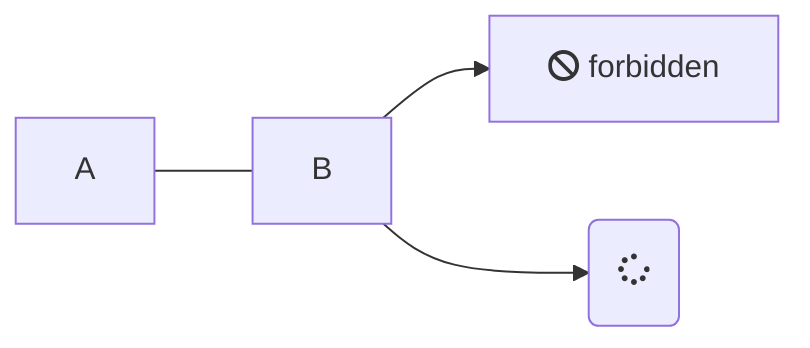

UPDATE: 2019-11-15

## 1 chortcodeを使う

[vjeantet/hugo-theme-docdock](https://github.com/vjeantet/hugo-theme-docdock/blob/master/layouts/shortcodes/mermaid.html)より
```html:shortcodes/mermaid.html
<script src="https://unpkg.com/mermaid@8.4.2/dist/mermaid.min.js" async></script>

<script async>
document.addEventListener("load", function(){
  mermaid.initialize({startOnLoad:true});
}, false);
</script>

<div class="mermaid" align="{{ if .Get "align" }}{{ .Get "align" }}{{ else }}center{{ end }}" >{{ safeHTML .Inner  }}</div>
```

```md:contet/post/hoge.md
{{ <mermaid align="left"> }} // spaceを取り除く
graph LR;
    A[Hard edge] -->|Link text| B(Round edge)
    B --> C{Decision}
    C -->|One| D[Result one]
    C -->|Two| E[Result two]
{{ </mermaid> }}
```


graph LR;
    A[Hard edge] -->|Link text| B(Round edge)
    B --> C{Decision}
    C -->|One| D[Result one]
    C -->|Two| E[Result two]



## 2 Code Fenceを使う
```md
    ```mermaid
    graph LR;
        A --- B
        B-->C[fa:fa-ban forbidden]
        B-->D(fa:fa-spinner);
    ```
```



次のコードはドコでも良い
```html
<script src="https://unpkg.com/mermaid@8.4.2/dist/mermaid.min.js" async></script>
<script>
window.addEventListener('load', function(){
  mermaid.init(undefined, "code.language-mermaid")
});
</script>
```

<script>
window.addEventListener("load", function(){
  mermaid.init(undefined, "code.language-mermaid");
}, false);
</script>


後々を考えると2が良いんだけど・・・
まあ置き換えは正規表現で簡単にできそうだから1で妥協しようか