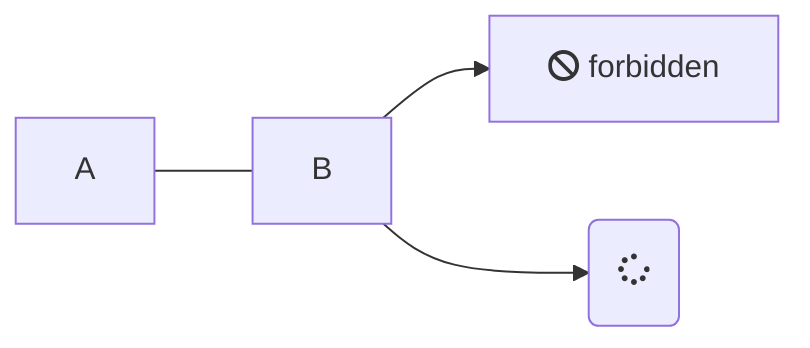

# 必要素材


```mermaid
graph LR;
  GOAL["青パック"]
  style GOAL stroke:red,stroke-width:4px

  subgraph 素材ライン
    鉄板
    銅板
    プラスチック棒
    鋼材
  end
  subgraph 最終ライン
    発展基盤
    エンジンユニット
    電動掘削機
  end

  発展基盤 --> GOAL
    プラスチック棒 -- x2 --> 発展基盤
    銅線           -- x4 -->  発展基盤
    電子基板       -- x2 --> 発展基盤

    鉄板       --> 電子基板
    銅線 -- x3 --> 電子基板
    銅板       --> 銅線

  エンジンユニット --> GOAL
    鋼材         --> エンジンユニット
    鉄の歯車     --> エンジンユニット
    パイプ -- x2 --> エンジンユニット
    鉄板   -- x2 --> 鉄の歯車
    鉄板         --> パイプ

  電動掘削機 --> GOAL
    鉄板           --> x10 電動掘削機
    鉄の歯車 -- x5 --> 電動掘削機
    電子基板 -- x3 --> 電動掘削機
```


graph LR;
  GOAL["青パック"]
  style GOAL stroke:red,stroke-width:4px

  subgraph 素材ライン
    鉄板
    銅板
    プラスチック棒
    鋼材
  end
  subgraph 最終ライン
    発展基盤
    エンジンユニット
    電動掘削機
  end

  発展基盤 --> GOAL
    プラスチック棒 -- x2 --> 発展基盤
    銅線           -- x4 -->  発展基盤
    電子基板       -- x2 --> 発展基盤

    鉄板       --> 電子基板
    銅線 -- x3 --> 電子基板
    銅板       --> 銅線

  エンジンユニット --> GOAL
    鋼材         --> エンジンユニット
    鉄の歯車     --> エンジンユニット
    パイプ -- x2 --> エンジンユニット
    鉄板   -- x2 --> 鉄の歯車
    鉄板         --> パイプ

  電動掘削機 --> GOAL
    鉄板           --> x10 電動掘削機
    鉄の歯車 -- x5 --> 電動掘削機
    電子基板 -- x3 --> 電動掘削機




<script src="https://cdnjs.cloudflare.com/ajax/libs/mermaid/7.1.2/mermaid.js">
</script>

<script>
mermaid.initialize({startOnLoad:true});
console.log('startOnload');
mermaid.init(".language-mermaid");

</script>


https://mermaidjs.github.io/flowchart.html


graph LR;
    subgraph Sub
      C2
    end

    A[Hard edge] -->|Link text| B(Round edge)
    B --> C{Decision}
    C -->|One| D[Result one]
    C -->|Two| E[Result two]
    C -- Three --> F[Result three]
    C == Four  ==> G[Result four]
    C2 --> H>Result Something]
    C2 -.-> J
    C2-. text .-> J2
    C2 --- K[fa:fa-ban forbidden]
    C2 -- text --- K2(A fa:fa-camera-retro perhaps?);



graph LR
    A --- B
    B-->C[fa:fa-ban forbidden]
    B-->D(fa:fa-spinner);




gantt
    title A Gantt Diagram
    dateFormat  YYYY-MM-DD
    section Section
    A task           :a1, 2014-01-01, 30d
    Another task     :after a1  , 20d
    section Another
    Task in sec      :2014-01-12  , 12d
    another task      : 24d


